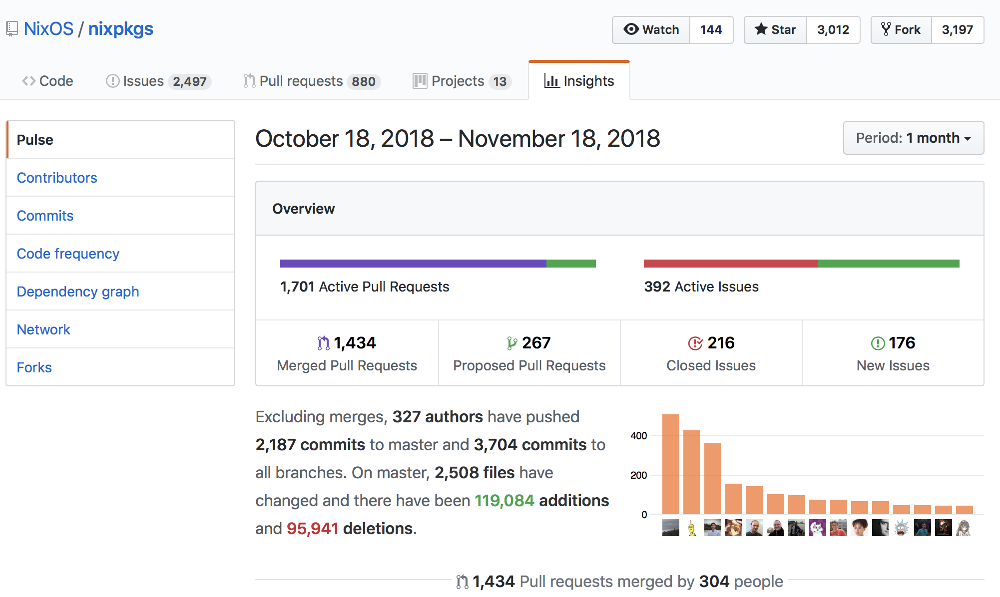
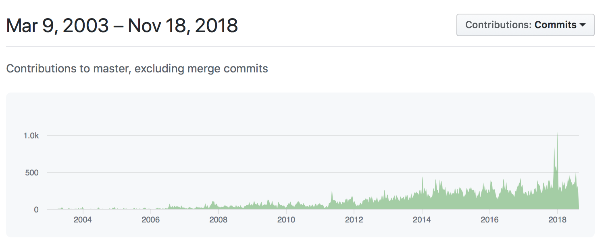

# Why should you care?


## What tools does your project require?

- How to install them? In which version?
- How to switch among projects?

## What tools does your project require?

JVM, gradle, NodeJS, python, curl, kpcli, etc.

- *How to install* them? In what version?
  - Undocumented: assume they are just there
  - Readme/Confluence: typically outdated
  - Shell script install: Globally? What about updates?
- *How to switch* between different requirements?
  (example: JDK8 versus JDK 11)

## Nothing but Nix required!

(pun intended)

```install.sh
# https://nixos.org/nix/download.html
curl https://nixos.org/nix/install | sh
```

```jq.sh
# Experiment: environment with 'jq' installed?
nix-shell '<nixpkgs>' -p jq  # shell with jq available
```

```jq.sh
# Develop: environment with all dependencies installed
nix-shell '<nixpkgs>' -A jq  --pure # to build jq
$ tar xvzf $src && cd jq*  # happy hacking...
  && ./configure && make && ./jq --version
> jq-1.5
```

## Outline

- Nix Ecosystem
- Nix 101 - The basics
- Advanced Nix Features
- References

# Nix Ecosystem

## Overview -- https://nixos.org/nix/

Nix is a package manager for *Linux and other Unix* that makes
package management *reliable* and *reproducible*.

It provides *atomic upgrades and rollbacks*,<br>
side-by-side installation of *multiple package versions*,
and *easy setup of build environments*


:::::::::::::: {.columns}
::: {.column width="50%"}
- Reliable
- Reproducible
- Great for developers
:::
::: {.column width="50%"}
- Multi-user, multi-version
- Source/binary model
- Portable
:::
::::::::::::::

## Nix History -- here to stay

The Purely Functional Software Deployment Model (Dolstra, PhD Thesis, 2006)

- C. 1. Nix Release 2.1 (2018-09-02)
- C. 2. Nix Release 2.0 (2018-02-22)
- C.17. Nix Release 1.0 (2012-05-11)
- C.32. Nix Release 0.6 (2004-11-14)


NixOS: A Purely Functional Linux Distro. (ICFP 2008)

- B. 1. NixOS Release 18.09 (“Jellyfish”, 2018/10/05)
- B.10. NixOS Release 13.10 (“Aardvark”, 2013/10/31)

<!--
## Nix is active


-->

## Nix is steadily growing




## Nix Ecosystem at large

- **Nix** The Purely Functional Package Manager
- **Nixpkgs** The Nix Packages collection
- **NixOS** The Purely Functional Linux Distribution
- **NixOps** The NixOS Cloud Deployment Tool
- **Disnix** Distributed service deployment toolset
- **Hydra** Continuous build system

and more..

Focus on: **Nix/Nixpkgs**, maybe NixOps


# Introduction: Let's get started
<!-- # Introduction to Nix(pkgs) -->


## A Minimal Example

```
# minimal.nix
pkgs = import <nixpkgs> {};

pkgs.stdenv.mkDerivation {
  name = "awesome-project";
  version = "1.0";
  buildInputs = with pkgs; [git gradle curl nodejs];
  # and potentially more things
}
```

- import nix-expressions from channel \<nixpkgs\>
- define a derivation with name and version
- specify build dependencies

## Nix-Shell: provides all dependencies


```
$ nix-shell minimal.nix --run 'which git gradle curl npm'
/nix/store/hbfjnla1p7qni7gdwd2j5ampyfmy55kz-git-2.19.1/bin/git
/nix/store/3f110h2fwmiabsw2rhw57sqjprbggrag-gradle-4.10/bin/gradle
/nix/store/0qklz87k9knxhimv6h9slizwrxm2fs9g-curl-7.61.1-bin/bin/curl
/nix/store/ghfhw6xza78bl7d340kipj06cazlircz-nodejs-8.11.4/bin/npm
```
- nix store keeps /nix/store/\$hash-\$name-\$version
- normal environment lacks tools

```
$ which git gradle curl npm
/Users/ale/.nix-profile/bin/git
gradle not found
/usr/bin/curl
npm not found
```

## nix build : requires build command


```
$ nix build -f minimal.nix

> builder for '/nix/store/nqyfn7kbfh98crcrzn9c2wx4fmj6z7kf-awesome-projgect.drv' failed with exit code 1; last 2 log lines:
>   unpacking sources
>   variable $src or $srcs should point to the source
> [0 built (1 failed), 0.0 MiB DL]
> error: build of '/nix/store/nqyfn7kbfh98crcrzn9c2wx4fmj6z7kf-awesome-projgect.drv' failed
```

- Fails, because we did not specify how to build
- focus on nix-shell, ie. "build-environment" for now

## mkDerivation: overridable "phases"

```
stdenv.mkDerivation {
        ...
  phases = ["buildPhase"];
  buildPhase = ''
    mkdir -p $out/bin
    cat << EOF > $out/bin/awesome-version
    #!${bash}/bin/bash
    ${gradle}/bin/gradle --version  #runtime dependency
    echo $(node --version)          #buildtime dependency
    EOF
    chmod +x $out/bin/awesome-version
  '';
}
```
- assumes "untar $src; configure; make; make install"
- language specific builders exist: Python, Haskell, etc.
- Note: $out/bin is added to the PATH in nix-shell!

## nix-env : "apt-get" with rollback

```
nix build -f minimal.nix; awesome-version   # fail; not installed
```

```
nix-env -f minimal.nix -i; awesome-version  # runs; installed
nix-env --list-generation                   # gen x+1
>  52   2018-11-19 17:24:01 (current)

nix-env -e awesome-project; awesome-version # fails; uninstalled
nix-env --list-generations                  # gen x+2
>  52   2018-11-19 17:24:01
>  53   2018-11-19 17:36:36   (current)

nix-env --rollback; awesome-version         # gen x+1 => runs
>  52   2018-11-19 17:24:01   (current)
>  53   2018-11-19 17:36:36
```


## nix-env : "apt-get" with rollback

```
nix-env -i subversion # path includes: svn
nix-env -i firefox    # path includes: firefox, svn
nix-env --rollback    # firefox is gone again
nix-env -e subversion # who needs subversion..
```

{ width=50% }


## Nix 101 -- The Summary

- Nix-Expression: define packages
- Derivation: concrete package (with fixed versions)
- Nix-Store: storage of all artifacts in /nix/store

### Typical commands

- nix-shell: enter shell with defined dependencies
- nix [search | repl | build | log]  "since 2.0"
- and some more (not detailed)
    - nix-build: explicitly build a derivation
    - nix-env: install a derivation in user env "apt-get"
    - nix-channel: "manage" what '\<nixpkgs\>' means


# Advanced Functionality

## Organize with imports

```
// awesome.nix : extract derivation details
{ stdenv, git, gradle, curl, nodejs }: # indicate dependencies
stdenv.mkDerivation { name = "awesome-project"; ... };
```

```
// default.nix
with (import <nixpkgs> {});
callPackage ./awesome.nix {}; # simply import other files
```
```
callPackage ./awesome.nix {}; # convenience for import & call
# import ./awesome.nix { stdenv=stdenv; gradle=gradle; ... }
# callPackage ./awesome.nix { gradle = gradle_5 }; # overrides
```

- import expression is "subsituted" by file content
- imports can be ./local, \<channel\>, git, tarball, etc.


## reproducibility: Pin nixpkgs version

Channel \<nixpkgs\> evolves over time
```
# with (import <nixpkgs> {});          # unpinned, may change
with (import ./nixpkgs.pinned.nix {}); # pinned
stdenv.mkDerivation { name = "awesome-project"; ... };
```

```
// nixpkgs.pinned.nix
import (builtins.fetchGit {
  name = "nixos-unstable-2018-11-19"; # Descriptive name
  url = https://github.com/nixos/nixpkgs/;
  # git ls-remote \
  #  https://github.com/nixos/nixpkgs-channels nixos-unstable
  rev = "80738ed9dc0ce48d7796baed5364eef8072c794d";
})
```

https://nixos.wiki/wiki/FAQ/Pinning_Nixpkgs


## Overlays for package customization

```
nix-build && ./result/bin/awesome-version # Without Overlay
Gradle 4.10.2
JVM:  1.8.0_121 (Azul Systems, Inc. 25.121-b15)
Node: v8.12.0
```

```
# select/replace/patch packages using overlays
let overlay = self: super: {
  jdk = self.jdk11;
  nodejs = self.nodejs-10_x;
}; in

with (import ./nixpkgs.pinned.nix { overlays = [overlay]; });
callPackage ./awesome.nix {}
```

```
nix-build && ./result/bin/awesome-version # # With Overlay
Gradle 4.10.2
JVM:  11.0.1 (Azul Systems, Inc. 11.0.1+13-LTS)
Node: v10.12.0
```

## Overlays -- Back to the future

```
# self: all packages after *all* overlays applied
# super: all packages before this overlay
overlay = self: super: { # return: set of package modifications
  jdk = self.jdk11; # default is jdk = jdk8
  # gradle depends on jdk will use jdk11 now
  # jdk = self.jdk would create an infinite loop!
}
```

```
let # a // b combines sets with entries in b "winning"
  initial = {};
  first   = initial // (overlay1 final initial)
  second  = first   // (overlay2 final first)
  final   = second  // (overlay3 final second)
in final # laziness allows using final as input
```

- https://blog.flyingcircus.io/2017/11/07/nixos-the-dos-and-donts-of-nixpkgs-overlays/
- https://youtu.be/6bLF7zqB7EM?t=39m50s

## Custom gradle version

```
// default.nix
let overlay = import ./overlay.nix; in
with (import ./nixpkgs.pinned.nix { overlays = [overlay]; });
callPackage ./awesome.nix {}
```

```
// overlays.nix
self: super: {
  jdk = self.jdk11; nodejs = self.nodejs-10_x;
  gradle = self.gradleGen.gradleGen rec {
    name = "gradle-5.0-rc-3"; # bleding edge not yet in nixpkgs
    nativeVersion = "0.14";
    src = super.fetchurl { # remote need a hash
url = "http://services.gradle.org/distributions/${name}-bin.zip";
sha256 = "087ai9i4fs1fyywsryijvysi38p244n3knh3gcy163gwj2nj0jk8";
    }; }; }
```
```
nix-build && ./result/bin/awesome-version
Gradle 5.0-rc-3
JVM:  11.0.1 (Azul Systems, Inc. 11.0.1+13-LTS)
Node: v10.12.0
```


## Price of reproducibility & isolation

- runtime-search-path (rpath) of artifact must be fixed

- gradle --version writes 'libnative-platform.dylib' in GRADLE_USER_HOME; which must be set explicitly

```
name = "awesome-project-2.0";
buildPhase = ''
  export GRADLE_USER_HOME=$TMPDIR
  mkdir -p $out/bin
  cat << EOF > $out/bin/awesome-version
  #!${stdenv.shell}
  #  \${gradle}/bin/gradle --version #previously runtime dep
  echo "$(gradle --version)"     #buildtime dependency
  echo "Node: $(node --version)" #buildtime dependency
  EOF
  chmod +x $out/bin/awesome-version
'';
```

## Handling multiple derivations

```
// default.nix
let overlay = import ./overlay.nix; in
with (import ./nixpkgs.pinned.nix { overlays = [overlay]; });
{ # attribute set of derivations
  awesome = callPackage ./awesome.nix {};
  more-awesome = callPackage ./moreawesome.nix {};
}
```
```
nix build -A more-awesome        # build selected derivation
nix build                        # build all attributes
nix-store -q --references result # result is a symlink to aweseom
> bash & gradle
nix-store -q --references result-2 # symlink to more awesome
> base
```

## Adding (sharable) helper scripts

```
// revealjs.nix
{ fetchgit, pandoc, writeShellScriptBin }: rec {
 reveal-js = fetchgit {
   url = "https://github.com/hakimel/reveal.js.git";
   rev = "65bdccd5807b6dfecad6eb3ea38872436d291e81";
   sha256="07460ij4v7l2j0agqd2dsg28gv18bf320rikcbj4pb54k5pr1218";
 };

 mkSlides = writeShellScriptBin "mkSlides" ''
   ${pandoc}/bin/pandoc -s -t revealjs --slide-level=2 \
     -V revealjs-url=${reveal-js} $1 > $1.html
 '';
}
```
```
// overlay.nix
{ .. revealJs = super.callPackage ./revealjs.nix {}; .. }
```
- Slides based on RevealJs/Pandoc

## Shell.nix & Default.nix

```
// shell.nix : used by nix-shell if present
# nix-shell: enter shell where 'mkSlides slides.md" works
(import ./default.nix).slides
```

```
// default.nix
# fallback for nix-shell and default for most other nix* tools
# nix build create all 3 artifacts => ./result, ./result-2/3
...
{ awesome = ...; moreawesome = ...;
  slides = stdenv.mkDerivation {
    name = "Slides"; src = ./slides.md;
    buildInputs = [revealJs.mkSlides]; phases = [ "buildPhase" ];
    buildPhase = ''
      mkdir -p $out;
      cp $src $out/index.md;
      mkSlides $out/index.md; # create index.md.html from md
    '';
  };
}
```

# Docker, NIX, and remote builder

## Docker comparison

- Docker create isolated run environment
  - requires mounting folder, passing env vars
  - provides network isolation (ports etc)
  - build differ: only jenkins in docker buildstacks
- Nix isolates at build (setting rpath etc)
  - multi-version in same environment possible
  - no network isolation at runtme
  - much more modular than docker
  - smaller community than docker

## TODO: stdenv.dockerTools {..}

- nix is modular!
  - mix and match the binaries you need!
  - various utilities to create users/etc.

- builts images without interaction with docker daemon!
  - does not need docker installed!
  - "from scratch" or based on base image
  - include only the bare minimal dependencies
  - single-layer or one-layer per 'derivation'*

- remote builder support
  - docker requires linux (not osx) binaries

## Remote Builders

- nix supports remote builder to create  
- remote builder support
  - docker requires linux (not osx) binaries
  - cross-compilation or remote builder needed
  - transparently offload build instruction to remote host
  building on osx => linux binaries => remote builders


# NixOPS
## Maybe Quick look at nixops

# References

## Documentation / References

- Nix Manual: https://nixos.org/nix/manual/
- Nix Pills: https://nixos.org/nixos/nix-pills/
- Packages: https://nixos.org/nixos/packages.html#
- Github: https://github.com/NixOS/nixpkgs
- https://nixos.wiki/wiki/Main_Page
- https://nixcloud.io/tour/?id=1

## Nice to know commands

nix search

nix edit nixpkgs.gradle

repl repl  => :l <nixpkgs>

nix log nixpkgs.jq

nix-store -q --tree /Users/ale/.nix-profile/bin/awesome-version


## Expriment with packages (Adhoc)

```
which kpcli
> kpcli not found

nix-shell '<nixpkgs>' -p kpcli --run 'kpcli --help'
> Usage: .kpcli-wrapped [--kdb=<file.kdb>] [--key=<file.key>] ...
```


```
git --version  => git version 2.18.0
nix-shell '<nixpkgs>' -p git           # enter environment
git --version  => git version 2.19.1   # within nix-shell
exit                                   # leave environment
git --version  => git version 2.18.0
```

## drawbackes?

- Community is not mainstream, but still quite big
  => numbers: packages, contributors
- Packaging requires freezing "dynamic dependencies"
  => unavoidable for true multiversioning!
  => makes packaging more complicated
  => typically done by package maintainers!
- OSX has less packages than linux
  => but typicall git/curl/jdk things work well

